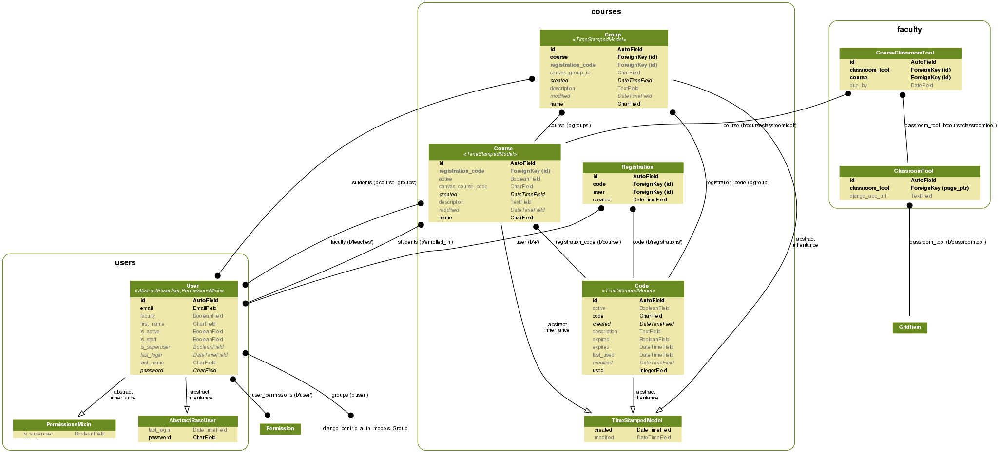

# A CentOS 7.2 Vagrant Box with Python 3.5 via Ansible
* Apache 2.4, with mod_wsgi for running Django
* FreeTDS drivers for MS SQL Server
* PostgreSQL Drivers & Server
* Node + npm

This repository contains a CentOS 7.2 box for Vagrant. Python 3.5.3 is installed alongside the system Python (2.7.5). The Vagrant config uses Ansible roles to configure the box for the development environment, that should also be suitable for setting up a production server.

MS SQL is also supported as a Django database backend with the FreeTDS ODBC Driver to SQL Server. PostgreSQL 9.6, including the server, can be install optionally for those using PostgreSQL.

Django versions 1.8 and greater are supported, however, Django 1.11 or greater is recommended at the time of this writing for new projects. Django 1.11 is an LTS (Long Term Support) release, meaning it will be actively supported with bug fixes and security patches until at least April, 2020 (and probably longer): https://www.djangoproject.com/download/#supported-versions

## Compatibility

### Mac / Linux

* Tested with Vagrant 1.9.1: https://releases.hashicorp.com/vagrant/1.9.1/vagrant_1.9.1.msi
* Tested with VirtualBox 5.0.24: http://download.virtualbox.org/virtualbox/5.0.24/VirtualBox-5.0.24-108355-OSX.dmg
* Git is required: http://git-scm.com/downloads
* Tested on: OS/X Yosemite, and El Capitan, and Sierra.

### Windows

* Tested with Vagrant 1.9.1: https://releases.hashicorp.com/vagrant/1.9.1/vagrant_1.9.1.msi
* Tested with VirtualBox 5.0.24: http://download.virtualbox.org/virtualbox/5.0.24/VirtualBox-5.0.24-108355-Win.exe
* Tested on: Windows 7, 8, and 10.
* Git Bash is required, not the Windows Command Prompt (cmd.exe): https://git-for-windows.github.io/
    * In Git Bash, click the diamond shaped multi-colored icon in the upper left of the window, OPTIONS. You may want to go through the option list to increase your default window size, set up copy/paste shortcuts, and set up mouse selection for copy/paste.
* On newer machines, ensure that you have virtualization enabled in BIOS (Google it for your machine's model).

## Get Started

* Create and add a public SSH key to your git server (GitHub, GitLab, etc).

* Clone the repository and bring up the virtual development environment. The first time you install the box, "vagrant up" will take a little while. Grab a cup of coffee or something!
* Use a host name for your domain; for example, if you're a member of The Wharton School, you may want to use the command `VAGRANT_HOSTNAME="vagrant.wharton.upenn.edu" vagrant up` below. If you don't provide a hostname, it will be set to `vagrant.example.com`.

``` bash
git clone https://github.com/wharton/python-vagrant-centos7.git
cd python-vagrant-centos7
VAGRANT_HOSTNAME="vagrant.my.domain.com" vagrant up
vagrant ssh
```

You can also add the host name to your computer's `hosts` file. Your `hosts` file should be located at:

* Mac / Linux: /etc/hosts
* Windows: %SystemRoot%\system32\drivers\etc\hosts

Add this line (with the appropriate host name, if you changed it):

``` bash
192.168.99.100  vagrant.my.domain.com
```

## Setting Up PostgreSQL & Getting Started

On your Vagrant box, a script has been provided to install PostgreSQL Server 9.6 and set up
the `vagrant` user as superuser alongside the system `postgres` user.

```
$ sudo /vagrant/assets/install_postgres.sh
$ psql
psql (9.6.2)
Type "help" for help.

vagrant=# \?
...
vagrant=# \q
```

## Creating ERDs of Django Models

The `django-extensions` app can build handy Entity Relationship Diagrams for Django apps, even your entire project. The pre-requisites for the Python packages are included with this Vagrant box.



First, install `django-extensions` and `pygraphviz`:

    pip install django-extensions pygraphviz

Next, add `django_extensions` to your `INSTALLED_APPS`. Then you can create the diagrams; to create a PNG of all models in your Django project.

    ./manage.py graph_models -a -g -o project-erd.png

Or, to just do a few Django apps:

    ./manage.py graph_models users faculty courses -g -o users-faculty-courses.png

## Windows 10: Forwarding Port 80 for Testing Apache

In Windows 10, the "World Wide Web Publishing Service" automatically starts on port 80. You can disable it so Vagrant can forward port 80.

* Click Start, type "Services" and open Services.
* Scroll down to World Wide Web Publishing Service. Right click and go into Properties.
* Change "Startup type" to be Manual.
* Click the "Stop" button.
* Click "OK".

Contributors:

* Tim Allen (tallen@wharton.upenn.edu)
* Gavin Burris (bug@wharton.upenn.edu)
* Dave Roller (roller@wharton.upenn.edu)
